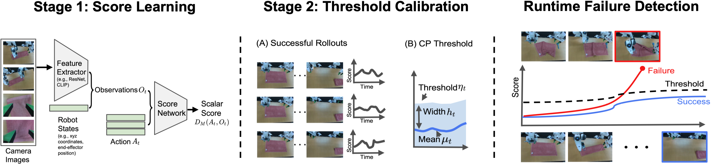

## FAIL-Detect: Failure Analysis in Imitation Learning – Detecting failures without failure data

<p align="center">
  
</p>

- Project website: https://cxu-tri.github.io/FAIL-Detect-Website/.
- The paper titled "[Can We Detect Failures Without Failure Data? Uncertainty-Aware Runtime Failure Detection for Imitation Learning Policies](https://arxiv.org/abs/2503.08558)" is accepted at Robotics: Science and Systems (RSS) 2025.
- Please direct implementation questions to Chen Xu (chen.xu@tri.global).

## Prerequisite

We base our environment on [diffusion_policy](https://github.com/real-stanford/diffusion_policy). Set up the environment by running

```
mamba env create -f conda_environment.yaml
conda activate faildetect
```

## Usage

### 1. Policy training

**Tasks**: we consider `square`, `transport`, `tool_hang`, and `can` tasks in [robomimic](https://robomimic.github.io/).

**Policy backbone**: Either diffusion policy or flow-matching policy. Both policies have the same network architecture and are trained on the same datasets with same hyperparameters.

**Usage**: see `diffusion_policy/configs_robomimic` for the set of configs.

```
# This trains a flow policy (e.g, on the square task)
python train.py --config-dir=diffusion_policy/configs_robomimic --config-name=image_square_ph_visual_flow_policy_cnn.yaml training.seed=1103 training.device=cuda:0 hydra.run.dir='data/outputs/${name}_${task_name}'
python train.py --config-dir=diffusion_policy/configs_robomimic --config-name=image_can_ph_visual_flow_policy_cnn.yaml training.seed=1103 training.device=cuda:0 hydra.run.dir='data/outputs/${name}_${task_name}'

# This trains a diffusion policy (e.g, on the square task)
python train.py --config-dir=diffusion_policy/configs_robomimic --config-name=image_square_ph_visual_diffusion_policy_cnn.yaml training.seed=1103 training.device=cuda:0 hydra.run.dir='data/outputs/${name}_${task_name}'
python train.py --config-dir=diffusion_policy/configs_robomimic --config-name=image_transport_ph_visual_diffusion_policy_cnn.yaml training.seed=1103 training.device=cuda:0 hydra.run.dir='data/outputs/${name}_${task_name}'
python train.py --config-dir=diffusion_policy/configs_robomimic --config-name=image_can_ph_visual_diffusion_policy_cnn.yaml training.seed=1103 training.device=cuda:0 hydra.run.dir='data/outputs/${name}_${task_name}'

# For other tasks, change 'square' to be among ['transport', 'tool_hang', 'can']
```

### 2. Obtain $\{(A_t, O_t)\}$ given a trained policy

Here, 
- $O_t$ = [Embedded visual features, non-visual information (e.g., robot states)]. 
- $A_t$ = corresponding action *in training data*.

```
# For flow policy (e.g, on the square task)
python save_data.py --config-dir=diffusion_policy/configs_robomimic \
--config-name=image_square_ph_visual_flow_policy_cnn.yaml \
training.seed=1103 training.device=cuda:0 hydra.run.dir='data/outputs/${name}_${task_name}' 

# For diffusion policy (e.g, on the square task)
python save_data.py --config-dir=diffusion_policy/configs_robomimic \
--config-name=image_square_ph_visual_diffusion_policy_cnn.yaml \
training.seed=1103 training.device=cuda:0 hydra.run.dir='data/outputs/${name}_${task_name}'
python save_data.py --config-dir=diffusion_policy/configs_robomimic \
--config-name=image_can_ph_visual_diffusion_policy_cnn.yaml \
training.seed=1103 training.device=cuda:0 hydra.run.dir='data/outputs/${name}_${task_name}'

# For other tasks, change 'square' to be among ['transport', 'tool_hang', 'can']
```

### 3. Train scalar scores given $\{(A_t, O_t)\}$

We give the examples of using **logpZO** and **RND**, which are the best performings ones. The other baselines are similar by switching to the corresponding folders

Only need to change torch version from 1.12.1 to 1.13.1 for DER.

```
cd UQ_baselines/logpZO/ # Or change to /RND/, /CFM/, /NatPN/, /DER/ ...
# flow policy
python train.py --policy_type='flow' --type 'square'
# diffusion policy
python train.py --policy_type='diffusion' --type 'square'
python train.py --policy_type='diffusion' --type 'can'
cd ../..

# For other tasks, change 'square' to be among ['transport', 'tool_hang', 'can']
```

### 4. Run evaluation

```
cd UQ_test
# modify = False is ID
python eval_together.py --policy_type='flow' --task_name='square' --device=0 --modify=false --num=2000
python eval_together.py --policy_type='diffusion' --task_name='square' --device=0 --modify=false --num=2000
HYDRA_FULL_ERROR=1 python eval_together.py --policy_type='diffusion' --task_name='can' --device=0 --modify=false --num=2000

# modify = True is OOD
python eval_together.py --policy_type='flow' --task_name='square' --device=0 --modify=true --num=2000
python eval_together.py --policy_type='diffusion' --task_name='square' --device=0 --modify=true --num=2000
python eval_together.py --policy_type='diffusion' --task_name='can' --device=0 --modify=true --num=2000
cd ..

# For other tasks, change 'square' to be among ['transport', 'tool_hang', 'can']
```

### 5. CP band + visualization

```
cd UQ_test
# flow
python plot_with_CP_band.py # Generate CP band and make decision
python barplot.py # Generate barplots

# diffusion
python plot_with_CP_band.py --diffusion_policy # Generate CP band and make decision
python barplot.py --diffusion_policy # Generate barplots
```
